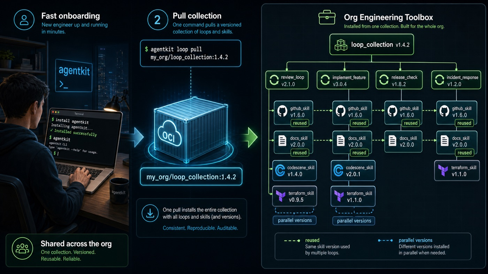

# agentkit

`agentkit` pushes, pulls, validates, and inspects OCI-backed Agent Loops
and Agent Skills.



## Install

Install the latest GitHub release for your platform and architecture:

```bash
curl -fsSL https://raw.githubusercontent.com/stumpyfr/agentkit/main/install.sh | sh
```

The installer downloads the matching `agentkit` binary and installs it to
`/usr/local/bin` by default. Override the destination with `INSTALL_DIR`:

```bash
curl -fsSL https://raw.githubusercontent.com/stumpyfr/agentkit/main/install.sh | INSTALL_DIR="$HOME/.local/bin" sh
```

## Commands

```bash
agentkit loop push ./loop.yml ghcr.io/owner/repo/loop-name:0.1.0
agentkit loop pull ghcr.io/owner/repo/loop-name:0.1.0
agentkit loop render ./loop.yml
agentkit loop render ghcr.io/owner/repo/loop-name:0.1.0
agentkit loop validate ./loop.yml
agentkit loop collection push ./loops.json ghcr.io/owner/repo/loops:0.1.0

agentkit skill push ./skill-dir ghcr.io/owner/repo/skill-name:1.0.0
agentkit skill pull ghcr.io/owner/repo/skill-name:1.0.0
agentkit skill validate ./skill-dir
agentkit skill collection push ./skills.json ghcr.io/owner/repo/skills:1.0.0
```

Pull commands auto-detect whether the reference points to a single artifact
or a collection. Pulled artifacts default to `.agents/`:

```text
.agents/
  loops/<loop-name>/loop.yml
  loops/<loop-name>/<version>/loop.yml
  skills/<skill-name>/SKILL.md
  skills/<skill-name>/<version>/SKILL.md
  agentkit.json
  agentkit.lock.json
```

Override the agentkit root with `--agents-dir`:

```bash
agentkit loop pull --agents-dir .custom-agents ghcr.io/owner/repo/loop-name:0.1.0
agentkit skill pull --agents-dir .custom-agents ghcr.io/owner/repo/skill-name:1.0.0
```

## OCI Media Types

Agent Loops:

```text
application/vnd.agentloops.loop.v1
application/vnd.agentloops.loop.content.v1+yaml
application/vnd.agentloops.loop.collection.v1
```

Agent Skills:

```text
application/vnd.agentskills.skill.v1
application/vnd.agentskills.skill.config.v1+json
application/vnd.agentskills.skill.content.v1.tar+gzip
application/vnd.agentskills.collection.v1
```

## Collections

Collection files are JSON and can use either `refs` or `items`:

```json
{
  "name": "engineering-toolbox",
  "refs": [
    "ghcr.io/acme/loops/implement-feature:0.1.0",
    "ghcr.io/acme/loops/review-loop:0.2.0"
  ]
}
```

```json
{
  "name": "engineering-skills",
  "items": [
    {
      "name": "github-pr-review",
      "ref": "ghcr.io/acme/skills/github-pr-review:1.4.0"
    }
  ]
}
```

## Authentication

Authentication uses Docker-compatible registry credentials. For GHCR:

```bash
docker login ghcr.io
```

For CI or non-Docker environments:

```bash
export GHCR_USERNAME=github-user-or-org
export GHCR_TOKEN=github-token-with-write-packages
```

In GitHub Actions, `GITHUB_ACTOR` and `GITHUB_TOKEN` are used automatically when
the `GHCR_*` variables are not set.

## Agent Guidance

```bash
agentkit init
agentkit quickstart
agentkit prime
```

`agentkit prime` prints agent-facing workflow context for resolving loop inputs,
pulling loop and skill dependencies, orchestrating phases, and writing run
artifacts.
